# RFC: `create_deep_agent` — 配置无关的 SDK 入口 API

## 1. 问题

当前 harness 的唯一公开入口是 `make_lead_agent(config: RunnableConfig)`。它内部：

```
make_lead_agent
  ├─ get_app_config()          ← 读 config.yaml
  ├─ _resolve_model_name()     ← 读 config.yaml
  ├─ load_agent_config()       ← 读 agents/{name}/config.yaml
  ├─ create_chat_model(name)   ← 读 config.yaml（反射加载 model class）
  ├─ get_available_tools()     ← 读 config.yaml + extensions_config.json
  ├─ apply_prompt_template()   ← 读 skills 目录 + memory.json
  └─ _build_middlewares()      ← 读 config.yaml（summarization、model vision）
```

**6 处隐式 I/O** — 全部依赖文件系统。如果你想把 `deerflow-harness` 当 Python 库嵌入自己的应用，你必须准备 `config.yaml` + `extensions_config.json` + skills 目录。这对 SDK 用户是不可接受的。

### 对比

| | `langchain.create_agent` | `make_lead_agent` | `create_deep_agent`（提案） |
|---|---|---|---|
| 定位 | 底层原语 | 应用级工厂 | **SDK 级工厂** |
| 配置来源 | 纯参数 | YAML 文件 | **纯参数** |
| 内置能力 | 无 | Sandbox/Memory/Skills/Subagent/... | **按需组合** |
| 适合谁 | 写 LangChain 的人 | 部署 DeerFlow 的人 | **用 deerflow-harness 做二次开发的人** |

## 2. 设计原则

### Python 中的 DI 最佳实践

Python 没有 Spring 的容器式 DI。社区共识的 "DI" 是：

1. **函数参数即注入** — 不读全局状态，所有依赖通过参数传入
2. **Protocol 定义契约** — 不依赖具体类，依赖行为接口
3. **合理默认值** — `sandbox=True` 等价于 `sandbox=LocalSandboxProvider()`
4. **分层 API** — 简单用法一行搞定，复杂用法有逃生舱

```
             用户视角
    ┌──────────────────────┐
    │   create_deep_agent  │  ← Level 1: SDK API，纯参数
    │   （本 RFC 的主题）    │
    └──────────┬───────────┘
               │ 内部调用
    ┌──────────▼───────────┐
    │  langchain.create_agent │ ← Level 0: 底层原语
    └──────────────────────┘

             应用视角
    ┌──────────────────────┐
    │  DeerFlowClient      │  ← Level 3: 高层封装（chat/stream/upload）
    └──────────┬───────────┘
    ┌──────────▼───────────┐
    │  make_lead_agent     │  ← Level 2: 配置驱动工厂（读 YAML → 调 Level 1）
    └──────────┬───────────┘
    ┌──────────▼───────────┐
    │  create_deep_agent   │  ← Level 1
    └──────────────────────┘
```

### 核心约束

- **零隐式 I/O** — 函数体内不读任何文件、不访问任何全局单例
- **harness 边界合规** — 不 import `app.*`（`test_harness_boundary.py` 强制）
- **向后兼容** — `make_lead_agent` 语义不变，改为薄壳调用 `create_deep_agent`

## 3. API 设计

### 3.1 函数签名

```python
# deerflow/agents/factory.py

from langchain.chat_models import BaseChatModel
from langchain.tools import BaseTool
from langchain.agents.middleware import AgentMiddleware

def create_deep_agent(
    # ── 必选：模型 ─────────────────────────────
    model: BaseChatModel,

    # ── 可选：工具 ─────────────────────────────
    tools: list[BaseTool] | None = None,

    # ── 可选：系统提示 ──────────────────────────
    system_prompt: str | None = None,

    # ── 可选：中间件（二选一）─────────────────────
    #   方式 A: 传完整列表，完全接管
    middleware: list[AgentMiddleware] | None = None,
    #   方式 B: 用 feature flags，自动组装（middleware=None 时生效）
    features: AgentFeatures | None = None,

    # ── 可选：状态 ──────────────────────────────
    state_schema: type | None = None,  # 默认 ThreadState
    checkpointer: BaseCheckpointSaver | None = None,

    # ── 可选：元数据 ─────────────────────────────
    name: str = "default",
) -> CompiledStateGraph:
    ...
```

### 3.2 `AgentFeatures` — 功能组合器

解决 "我想要 sandbox + memory，但不想自己排列 12 个 middleware" 的问题。

```python
from dataclasses import dataclass, field
from typing import Protocol

@dataclass
class AgentFeatures:
    """声明式功能开关。create_deep_agent 根据此对象自动组装 middleware 链。"""

    # ── Sandbox ────────────────────────────────
    sandbox: SandboxProvider | bool = True
    # True  → LocalSandboxProvider()
    # False → 不加载 sandbox 相关 middleware
    # 实例  → 使用自定义 provider

    # ── Memory ─────────────────────────────────
    memory: MemoryOptions | bool = False
    # True  → MemoryOptions() 使用默认值
    # False → 不加载
    # 实例  → 自定义配置

    # ── Summarization ──────────────────────────
    summarization: SummarizationOptions | bool = False

    # ── Plan Mode (TodoList) ───────────────────
    plan_mode: bool = False

    # ── Subagent ───────────────────────────────
    subagent: SubagentOptions | bool = False

    # ── Vision ─────────────────────────────────
    vision: bool = False
    # True → 添加 ViewImageMiddleware + view_image_tool

    # ── Title ──────────────────────────────────
    auto_title: bool = True

    # ── Loop Detection ─────────────────────────
    loop_detection: bool = True

    # ── Skills ─────────────────────────────────
    skills: list[str] | str | None = None
    # None    → 不注入 skills
    # str     → 目录路径，自动扫描
    # list    → 明确的 skill 内容或路径列表

    # ── Extra Middleware ────────────────────────
    extra_middleware: list[AgentMiddleware] = field(default_factory=list)
    # 追加到自动组装链的末尾（ClarificationMiddleware 之前）
```

### 3.3 功能选项详情

```python
@dataclass
class MemoryOptions:
    storage_path: str | Path = ".deer-flow/memory.json"
    injection_enabled: bool = True
    max_injection_tokens: int = 2000
    max_facts: int = 100
    debounce_seconds: float = 30.0
    model: BaseChatModel | None = None  # 用于 memory 更新的模型，None=复用主模型

@dataclass
class SummarizationOptions:
    model: BaseChatModel | str | None = None
    trigger: ... = None   # 复用现有 trigger 配置类型
    keep: ... = None

@dataclass
class SubagentOptions:
    enabled: bool = True
    max_concurrent: int = 3
    timeout_seconds: int = 900
    builtin_agents: list[str] = field(default_factory=lambda: ["general-purpose", "bash"])
```

### 3.4 中间件自动排序

当使用 `features` 模式时，`create_deep_agent` 内部按固定优先级组装：

```python
# 优先级常量（越小越先执行）
MIDDLEWARE_ORDER = {
    "thread_data":       100,   # 创建线程目录
    "uploads":           200,   # 追踪上传文件
    "sandbox":           300,   # 获取 sandbox
    "dangling_tool_call": 400,  # 修补缺失 ToolMessage
    "tool_error":        500,   # 工具异常 → ToolMessage
    "summarization":     600,   # 上下文压缩
    "todo_list":         700,   # 任务管理
    "title":             800,   # 自动标题
    "memory":            900,   # 记忆队列
    "view_image":        1000,  # 图片注入
    "subagent_limit":    1100,  # 子代理并发限制
    "loop_detection":    1200,  # 循环检测
    "clarification":     9999,  # 必须最后（拦截 ask_clarification）
}
```

用户通过 `extra_middleware` 追加的中间件插入 `clarification` 之前。

### 3.5 返回值

返回 `CompiledStateGraph`（与 `langchain.create_agent` 一致），可直接 `.invoke()` / `.stream()`。

## 4. 使用示例

### 4.1 最简 — 3 行创建 agent

```python
from langchain_openai import ChatOpenAI
from deerflow import create_deep_agent

agent = create_deep_agent(
    model=ChatOpenAI(model="gpt-4o"),
    tools=[my_search_tool, my_code_tool],
)

result = agent.invoke({"messages": [("user", "Hello")]})
```

不需要 config.yaml。不需要 extensions_config.json。不需要 skills 目录。

### 4.2 标准 — 带 sandbox + memory

```python
from langchain_anthropic import ChatAnthropic
from deerflow import create_deep_agent, AgentFeatures
from deerflow.sandbox.local import LocalSandboxProvider

agent = create_deep_agent(
    model=ChatAnthropic(model="claude-sonnet-4-20250514"),
    tools=[tavily_search, jina_fetch],
    features=AgentFeatures(
        sandbox=LocalSandboxProvider(),
        memory=True,          # 使用默认 memory 配置
        vision=True,          # 启用视觉
        skills="./skills",    # 自动扫描 skills 目录
    ),
    system_prompt="You are a research assistant...",
)
```

### 4.3 完全控制 — 自定义 middleware 链

```python
from deerflow import create_deep_agent
from deerflow.agents.middlewares import (
    SandboxMiddleware, MemoryMiddleware, ClarificationMiddleware
)

agent = create_deep_agent(
    model=my_model,
    tools=my_tools,
    middleware=[                   # 完全接管，不用 features
        SandboxMiddleware(),
        MemoryMiddleware(),
        MyCustomMiddleware(),
        ClarificationMiddleware(),  # 用户自己保证顺序
    ],
    system_prompt=my_prompt,
)
```

### 4.4 从配置创建（向后兼容）

```python
# make_lead_agent 变成 create_deep_agent 的薄壳：
def make_lead_agent(config: RunnableConfig):
    cfg = config.get("configurable", {})
    app_config = get_app_config()

    model = create_chat_model(name=..., thinking_enabled=...)
    tools = get_available_tools(...)

    return create_deep_agent(
        model=model,
        tools=tools,
        features=AgentFeatures(
            sandbox=_resolve_sandbox_provider(),
            memory=_resolve_memory_options(),
            summarization=_resolve_summarization_options(),
            plan_mode=cfg.get("is_plan_mode", False),
            subagent=SubagentOptions(enabled=cfg.get("subagent_enabled", False)),
            vision=model_config.supports_vision if model_config else False,
            skills=...,
        ),
        system_prompt=apply_prompt_template(...),
        name=cfg.get("agent_name", "default"),
    )
```

## 5. 内部实现草案

```python
def create_deep_agent(
    model: BaseChatModel,
    tools: list[BaseTool] | None = None,
    system_prompt: str | None = None,
    middleware: list[AgentMiddleware] | None = None,
    features: AgentFeatures | None = None,
    state_schema: type | None = None,
    checkpointer: BaseCheckpointSaver | None = None,
    name: str = "default",
) -> CompiledStateGraph:
    """创建一个 DeerFlow agent。纯参数，不读任何配置文件。"""

    effective_tools = list(tools or [])
    effective_state = state_schema or ThreadState

    if middleware is not None:
        # 方式 A: 用户完全接管 middleware
        effective_middleware = middleware
    else:
        # 方式 B: 从 features 自动组装
        feat = features or AgentFeatures()
        effective_middleware, extra_tools = _assemble_from_features(feat, model)
        effective_tools.extend(extra_tools)

    if system_prompt is None:
        system_prompt = _default_system_prompt(name)

    graph = create_agent(
        model=model,
        tools=effective_tools,
        middleware=effective_middleware,
        system_prompt=system_prompt,
        state_schema=effective_state,
    )

    if checkpointer is not None:
        graph = graph.compile(checkpointer=checkpointer)

    return graph


def _assemble_from_features(
    feat: AgentFeatures,
    model: BaseChatModel,
) -> tuple[list[AgentMiddleware], list[BaseTool]]:
    """根据 features 声明，按优先级组装 middleware 链 + 额外 tools。"""
    pending: list[tuple[int, AgentMiddleware]] = []
    extra_tools: list[BaseTool] = []

    # --- Sandbox ---
    if feat.sandbox is not False:
        from deerflow.agents.middlewares.thread_data_middleware import ThreadDataMiddleware
        from deerflow.agents.middlewares.uploads_middleware import UploadsMiddleware
        from deerflow.sandbox.middleware import SandboxMiddleware

        pending.append((100, ThreadDataMiddleware()))
        pending.append((200, UploadsMiddleware()))
        provider = feat.sandbox if isinstance(feat.sandbox, SandboxProvider) else None
        pending.append((300, SandboxMiddleware(provider=provider)))

    # --- Dangling / Error ---
    pending.append((400, DanglingToolCallMiddleware()))
    pending.append((500, ToolErrorHandlingMiddleware()))

    # --- Summarization ---
    if feat.summarization is not False:
        opts = feat.summarization if isinstance(feat.summarization, SummarizationOptions) else SummarizationOptions()
        mw = _build_summarization_mw(opts, model)
        if mw:
            pending.append((600, mw))

    # --- Plan Mode ---
    if feat.plan_mode:
        pending.append((700, TodoMiddleware(...)))

    # --- Title ---
    if feat.auto_title:
        pending.append((800, TitleMiddleware()))

    # --- Memory ---
    if feat.memory is not False:
        opts = feat.memory if isinstance(feat.memory, MemoryOptions) else MemoryOptions()
        pending.append((900, MemoryMiddleware(storage_path=opts.storage_path, ...)))

    # --- Vision ---
    if feat.vision:
        from deerflow.agents.middlewares.view_image_middleware import ViewImageMiddleware
        from deerflow.tools.builtins import view_image_tool
        pending.append((1000, ViewImageMiddleware()))
        extra_tools.append(view_image_tool)

    # --- Subagent ---
    if feat.subagent is not False:
        opts = feat.subagent if isinstance(feat.subagent, SubagentOptions) else SubagentOptions()
        pending.append((1100, SubagentLimitMiddleware(max_concurrent=opts.max_concurrent)))
        extra_tools.append(task_tool)

    # --- Loop Detection ---
    if feat.loop_detection:
        pending.append((1200, LoopDetectionMiddleware()))

    # --- Extra (user-provided) ---
    for i, mw in enumerate(feat.extra_middleware):
        pending.append((8000 + i, mw))

    # --- Clarification (always last) ---
    from deerflow.tools.builtins import ask_clarification_tool
    pending.append((9999, ClarificationMiddleware()))
    extra_tools.append(ask_clarification_tool)

    # 按优先级排序
    pending.sort(key=lambda x: x[0])
    return [mw for _, mw in pending], extra_tools
```

## 6. 迁移路径

```
Phase 1: 新增 create_deep_agent（本 RFC）
  - 新增 deerflow/agents/factory.py
  - 新增 deerflow/agents/features.py（AgentFeatures + Options）
  - 不改 make_lead_agent，两者共存

Phase 2: make_lead_agent 改为薄壳
  - make_lead_agent 内部改为：读 config → 构造参数 → 调 create_deep_agent
  - 所有现有测试不变
  - DeerFlowClient 可选择直接用 create_deep_agent

Phase 3: 公开 SDK API
  - deerflow/__init__.py 导出 create_deep_agent, AgentFeatures
  - 写 SDK 文档和示例
```

## 7. 需要讨论的问题

### Q1: 命名

| 候选 | 优点 | 缺点 |
|------|------|------|
| `create_deep_agent` | 对标 LangChain，语义清晰 | "deep" 含义模糊，容易和 deep learning 混淆 |
| `create_harness` | 与包名 `deerflow-harness` 一致 | 返回的是 agent 不是 harness |
| `create_agent` | 最简洁，`deerflow.create_agent()` | 与 `langchain.agents.create_agent` 撞名 |
| `build_agent` | 暗示 builder 语义 | 略啰嗦 |

**倾向**：`create_deep_agent` — 与 LangChain 生态对齐，且 `from deerflow import create_deep_agent` 无歧义。

### Q2: `features` vs 展开为独立参数

```python
# 方案 A: 聚合到 AgentFeatures 对象
create_deep_agent(model=..., features=AgentFeatures(sandbox=True, memory=True))

# 方案 B: 展开为独立 kwargs
create_deep_agent(model=..., sandbox=True, memory=True)
```

**方案 A 的优势**：
- 参数列表不膨胀（目前 10 个 feature，以后可能更多）
- `AgentFeatures` 可序列化、可复用、可继承
- 类型提示更精确

**方案 B 的优势**：
- 调用更扁平，对简单用法更友好
- 不用额外 import `AgentFeatures`

**倾向**：方案 A。功能多了以后方案 B 会让签名爆炸。而且 `AgentFeatures` 是一个独立可测试的单元。

### Q3: middleware 参数冲突处理

当同时传了 `middleware` 和 `features` 时：
- **选项 A**：`middleware` 优先，`features` 被忽略（当前设计）
- **选项 B**：报错 `ValueError("Cannot specify both middleware and features")`
- **选项 C**：`features` 生成基础链，`middleware` 追加

**倾向**：选项 B，显式胜过隐式。

### Q4: 内置 tools 注入策略

目前 `get_available_tools()` 自动注入 `present_file_tool`、`ask_clarification_tool` 等内置 tools。新 API 中：
- **选项 A**：不自动注入，用户完全控制 tools 列表
- **选项 B**：根据 features 自动注入（sandbox 启用时加 sandbox tools，vision 启用时加 view_image_tool）
- **选项 C**：A + B 都支持，通过 `auto_inject_tools: bool = True` 控制

**倾向**：选项 B。这是 "harness" 的核心价值 — 你启用一个 feature，相关的 tools 自动就位。但用户传入的 `tools` 列表优先级最高（相同名字不重复添加）。

### Q5: `model` 参数是否接受字符串

```python
# 选项 A: 只接受实例（纯 SDK 风格）
create_deep_agent(model=ChatOpenAI(model="gpt-4o"))

# 选项 B: 也接受字符串（如果有 config 就走 config 解析）
create_deep_agent(model="gpt-4o")  # 需要 config.yaml
```

**倾向**：选项 A。字符串意味着隐式配置查找，违背"零隐式 I/O"原则。`make_lead_agent` 保留字符串到实例的转换。

## 8. 附录：当前 middleware 依赖关系

```mermaid
graph LR
    subgraph 基础设施
        TD[ThreadData<br/>100] --> UL[Uploads<br/>200]
        UL --> SB[Sandbox<br/>300]
    end

    subgraph 消息修复
        DTC[DanglingToolCall<br/>400]
        TEH[ToolErrorHandling<br/>500]
    end

    subgraph 功能层
        SUM[Summarization<br/>600]
        TODO[TodoList<br/>700]
        TIT[Title<br/>800]
        MEM[Memory<br/>900]
        VI[ViewImage<br/>1000]
        SAL[SubagentLimit<br/>1100]
        LD[LoopDetection<br/>1200]
    end

    subgraph 拦截
        CL[Clarification<br/>9999]
    end

    SB --> DTC --> TEH --> SUM --> TODO --> TIT --> MEM --> VI --> SAL --> LD --> CL

    style TD fill:#a8b5a0,stroke:#6b7a63
    style UL fill:#a8b5a0,stroke:#6b7a63
    style SB fill:#a8b5a0,stroke:#6b7a63
    style DTC fill:#b5a8a0,stroke:#7a6b63
    style TEH fill:#b5a8a0,stroke:#7a6b63
    style SUM fill:#a0a8b5,stroke:#636b7a
    style TODO fill:#a0a8b5,stroke:#636b7a
    style TIT fill:#a0a8b5,stroke:#636b7a
    style MEM fill:#a0a8b5,stroke:#636b7a
    style VI fill:#a0a8b5,stroke:#636b7a
    style SAL fill:#a0a8b5,stroke:#636b7a
    style LD fill:#a0a8b5,stroke:#636b7a
    style CL fill:#b5a0a8,stroke:#7a636b
```



**硬依赖**（顺序不可变）：
- `ThreadData` 必须在 `Sandbox` 之前（sandbox 需要 thread 目录）
- `Uploads` 必须在 `Sandbox` 之后的 middleware 之前（提供上传文件信息）
- `Clarification` 必须最后（拦截 `ask_clarification` 后中断流程）

**软依赖**（推荐顺序）：
- `Summarization` 在 `Memory` 之前（先压缩再记忆，避免记忆冗余内容）
- `Title` 在 `Memory` 之前（标题生成不依赖记忆，但记忆可能引用标题）
- `ViewImage` 在 model 调用前注入图片数据
